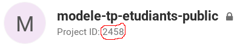

# Practical Work Manager (pwm)

Programme python pour gérer les travaux pratiques des étudiants avec la contrainte d'utiliser le gitlab d'HEPIA.

## TL;DR

- Créer un groupe et les repositories en une seule commande (avec un repository "image" optionnel) : `python pwm -t TOKEN group_repos GROUP_NAME REPOS_FILE [-i IMPORT_URL]`, voir [Syntaxe du fichier YAML (REPOS_FILE)](#syntaxe-du-fichier-yaml-repos_file)
- Clone tous les projets des étudiants d'un groupe gitlab (`ID`) dans un répertoire créé à la volée : `python pwm -t TOKEN clone ID DIRECTORY`

- [Practical Work Manager (pwm)](#practical-work-manager-pwm)
  - [TL;DR](#tldr)
  - [Workflow d'utilisation](#workflow-dutilisation)
  - [Utilisation de pwm](#utilisation-de-pwm)
    - [Création d'un groupe et des projets](#création-dun-groupe-et-des-projets)
    - [Création d'un groupe seulement](#création-dun-groupe-seulement)
    - [Création d'un sous-projet dans le groupe](#création-dun-sous-projet-dans-le-groupe)
    - [Clone de tous les repositories](#clone-de-tous-les-repositories)
  - [Syntaxe du fichier YAML (REPOS_FILE)](#syntaxe-du-fichier-yaml-repos_file)
    - [Noms et emails](#noms-et-emails)
    - [Emails seulement](#emails-seulement)

## Workflow d'utilisation
Pour expliquer la démarche d'utilisation, prenons le scénario suivant :
- L'enseignant Michel Albuquerque prépare un nouveau travail pratique (TP). Il souhaite forcer les étudiants à utiliser git et gitedu pour qu'ils versionnent leur code et pour qu'il puisse visualiser et recevoir leur rendus.
- Les TPs sont à faire par groupe ou de manière individuelle.
- Pour transmettre son énoncé et des fichiers (exemples, squelette de code, librairies, binaires, etc.) aux étudiants, Michel Albuquerque crée un repository git accessible publiquement, nommé "super-tp".
- Grâce à ce repository "super-tp", il peut mettre à jour le contenu distribué aux étudiants, en leur offrant la possibilité de visualiser les changements incrémentaux survenus.

Le moment est venu de créer les dépôts git pour chaque groupe/étudiant suivant le cours et devant réaliser le TP. Sur la base d'une liste de groupes ou d'étudiants, Michel Albuquerque pourra utiliser le programme pour :
1. Créer le groupe (namespace) dédié au cours/TP, contenant tous les repositories des étudiants.
1. Créer chaque repository pour chaque groupe/étudiant avec les contraintes nécessaires (privé, accessible à (aux) l'étudiant(s) concerné(s), aux enseignants, etc.)
1. Récupérer (clone) sur sa machine tous les repositories d'un seul coup, dans des répertoires séparés, au moment du rendu par exemple.

## Utilisation de pwm

Ce programme est écrit en python et testé avec la version 3.9.0, avec les dépendances suivantes (voir `requirements.txt`) :

```
requests
pyyaml
```

Pour rappel, pour ne pas à avoir à installer ces deux dépendances au niveau système, les commandes suivantes génèrent un environnement virtuel :

```bash
python -m venv .venv
source .venv/bin/activate
pip install -r requirements.txt
```

pwm se présente sous la forme d'une CLI. Il nécessite un `token` gitlab, pouvant être généré [sur cette page](https://gitedu.hesge.ch/profile/personal_access_tokens), en cochant la case "api". Ce `token` peut ensuite être utilisé de trois manières :

1. Écrit dans le fichier `~/.gitedu_token`
2. Placé dans la variable d'environnement `GITEDU_TOKEN`
3. Donné en argument de `pwm` avec l'option `-t` ou `--token`

Selon les commandes, un `project_id` ou `group_id` est également nécessaire, il correspond à celui affiché sur la page du groupe / projet :



L'exécution du programme sans arguments affiche l'aide et le détail pour chaque sous-commande.

### Création d'un groupe et des projets
```bash
python pwm group_repos GROUP_NAME REPOS_FILE [-h] [--visibility VISIBILITY] [-i IMPORT_URL] [-x EXPIRES_AT]
```
Exécute les opérations de création de groupe et de repositories à partir d'un fichier YAML (voir [Syntaxe du fichier YAML (REPOS_FILE)](#syntaxe-du-fichier-yaml-repos_file)). Voir les sous-sections suivantes pour les détails des sous-commandes.

### Création d'un groupe seulement
```bash
python pwm group [-h] [--visibility VISIBILITY] GROUP_NAME
```
Crée un groupe au sens gitlab du terme, nommé `GROUP_NAME`, avec la visibilité optionnelle `VISIBILITY` (`private`, `internal` ou `public`), par défaut privée. Si le groupe existe déjà, ne fait rien. Retourne le `group_id` du groupe créé, nécessaire pour la création des sous-projets par exemple.

### Création d'un sous-projet dans le groupe
```bash
python pwm repo [-h] [-n NAME] [-i IMPORT_URL] [-x EXPIRES_AT] GROUP_ID EMAILS
```
Crée un dépôt git (projet) au sein d'un groupe à partir de l'URL d'un projet existant pour une liste d'emails d'étudiants. Détail des arguments :
- `NAME` : optionnel, le nom du nouveau repository à créer pour le ou les étudiants concernés. Si non renseigné, prend la première partie du premier email dans `EMAILS`.
- `IMPORT_URL` : optionnel, l'URL (http) du projet (repository) existant. Ce projet doit être public.
- `EXPIRES_AT`: optionnel, au format `YYYY-MM-DD`, supprime les étudiants ajoutés à la date donnée (ils ne peuvent plus `push`).
- `GROUP_ID` : l'identifiant du groupe dédié au cours/TP, créé précédemment.
- `EMAILS` : une liste d'emails des étudiants. Les emails sont séparés par une virgule. Peut contenir un seul email.

### Clone de tous les repositories
```bash
python pwm clone [-h] [-g | -f] [-u UNTIL_DATE] ID DIRECTORY
```
Clone tous les repositories d'un groupe (`-g`) ou tous les forks d'un projet (`-f`) selon l'id (`ID`) donné dans un répertoire nommé `DIRECTORY`. Si une date `UNTIL_DATE` (au format `YYYY-MM-DD hh:mm`) est donnée, exécute un `git checkout` sur le premier commit précédant cette date. Affiche sur la sortie standard les membres du groupe (avec un droit d'accès supérieur à *Reporter*), l'url web du repo et dans quel sous-répertoire se trouvent les fichiers.

## Syntaxe du fichier YAML (REPOS_FILE)
Le fichier YAML doit respecter une des deux syntaxes suivantes.

### Noms et emails
Pour chaque projet créé, un nom et une liste d'emails doivent être renseignés :

```yaml
- name: group1
  emails:
  - prenom.nom11@hesge.ch
  - prenom.nom12@hesge.ch
- name: group2
  emails:
  - prenom.nom21@hesge.ch
  - prenom.nom22@hesge.ch
- name: group3
  emails:
  - prenom.nom31@hesge.ch
  - prenom.nom32@hesge.ch
```

### Emails seulement
Si uniquement les emails sont fournis, prend le premier nom de chaque email pour nom de projet :

```yaml
- emails:
  - prenom.nom11@hesge.ch # project_name = prenom.nom11
  - prenom.nom12@hesge.ch
- emails:
  - prenom.nom21@hesge.ch # project_name = prenom.nom21
  - prenom.nom22@hesge.ch
- emails:
  - prenom.nom31@hesge.ch # project_name = prenom.nom31
  - prenom.nom32@hesge.ch
```
