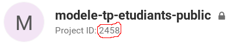

# Practical Work Manager (pwm)

Ce repository contient différents scripts python pour gérer la réalisation de travaux pratiques par les étudiants avec la contrainte d'utiliser le gitlab d'HEPIA.

## Workflow d'utilisation
Pour expliquer la démarche d'utilisation, prenons le scénario suivant :
- L'enseignant Michel Albuquerque prépare un nouveau travail pratique (TP). Il souhaite forcer les étudiants à utiliser git et githepia pour qu'ils versionnent leur code et pour qu'il puisse visualiser et recevoir leur rendus.
- Les TPs sont à faire par groupe ou de manière individuelle.
- Pour transmettre son énoncé et des fichiers (exemples, squelette de code, librairies, binaires, etc.) aux étudiants, Michel Albuquerque crée un repository git accessible publiquement, nommé "super-tp".
- Grâce à ce repository "super-tp", il peut mettre à jour le contenu distribué aux étudiants, en leur offrant la possibilité de visualiser les changements incrémentaux survenus.

Le moment est venu de créer les dépôts git pour chaque groupe/étudiant suivant le cours et devant réaliser le TP. Sur la base d'une liste de groupes ou d'étudiants, Michel Albuquerque pourra utiliser les scripts suivants pour :
1. Créer le groupe (namespace) dédié au cours/TP, contenant tous les repositories des étudiants.
1. Créer chaque repository pour chaque groupe/étudiant avec les contraintes nécessaires (privé, accessible à (aux) l'étudiant(s) concerné(s), aux enseignants, etc.)
1. Récupérer (clone) sur sa machine tous les repositories d'un seul coup, dans des répertoires séparés, au moment du rendu par exemple.

La section suivante décrit l'utilisation des scripts.

## Utilisation des scripts

Tous les scripts sont (actuellement) écrits en python et testés avec la version 3.6.8, sans dépendances à des librairies externes. Ils se présentent sous la forme de programmes à lancer dans un shell en ligne de commande. Ils nécessitent tous un `token` gitlab, pouvant être généré [sur cette page](https://gitedu.hesge.ch/profile/personal_access_tokens), en cochant la case "api". Certains attendent également un `project_id` correspond à celui affiché sur la page de repo :



### create_group.py
```bash
python3 create_group.py <token> <group_name> <visibility>
```
Crée un groupe au sens gitlab du terme, nommé `group_name`, avec la visibilité optionnelle `visibility` (`private`, `internal` ou `public`), par défaut privée. Si le groupe existe déjà, ne fait rien. Retourne le `group_id` du groupe créé, nécessaire pour `create_repo_for_students.py` par exemple.

### create_repo_for_students.py
```bash
python3 create_repo_for_students.py <token> <import_url> <group_id> <project_name> <student1,student2,...,studentN> <expires_at>
```
Crée un dépôt git (projet) au sein d'un groupe à partir de l'URL d'un projet existant pour une liste d'étudiants. Détail des arguments :
- `token` : le token gitlab.
- `import_url` : l'URL (http) du projet (repository) existant. Ce projet doit être public.
- `group_id` : l'identifiant du groupe dédié au cours/TP, créé précédemment (avec `create_group.py` par exemple).
- `project_name` : le nom du nouveau repository à créer pour le ou les étudiants concernés.
- `student1,student2,...,studentN` : une liste de login gitlab des étudiants. Les login sont séparés par une virgule. Peut contenir un seul login.
- `expires_at`: optionnel, au format `AAAA-MM-DD`, supprime les étudiants ajoutés à la date donnée.

### clone_all_repos_in_group.py
```bash
python3 clone_all_repos_in_group.py <token> <group_id> <directory> <until_date>
```
Clone tous les repositories d'un groupe `group_id` donné dans un répertoire nommé `directory`. Si une date `until_date` (au format `AAAA-MM-DD hh:mm`) est donnée, exécute un `git checkout` sur le premier commit précédant cette date. Affiche sur la sortie standard les membres du groupe, l'url web du repo et dans quel sous-répertoire se trouvent les fichiers.

### clone_all_forks.py
```bash
python3 clone_all_forks.py <token> <project_id> <directory> <until_date>
```
Clone tous les forks d'un projet `project_id` donné dans un répertoire nommé `directory`. Si une date `until_date` (au format `AAAA-MM-DD hh:mm`) est donnée, exécute un `git checkout` sur le premier commit précédant cette date. Affiche sur la sortie standard les membres du groupe (avec un droit d'accès supérieur à *Reporter*), l'url web du repo et dans quel sous-répertoire se trouvent les fichiers.

## "Convenient" script
```bash
./create_group_and_repos.sh <token> <group_name> <import_url> <repos_students>
```
Un script bash est également disponible, `create_group_and_repos.sh` qui permet de "batcher" les opérations de création de groupe et d'ajout des étudiants à partir d'un fichier texte `repos_students` formaté ainsi :
```
group1;user1,user2
group2;user3,user4
```
